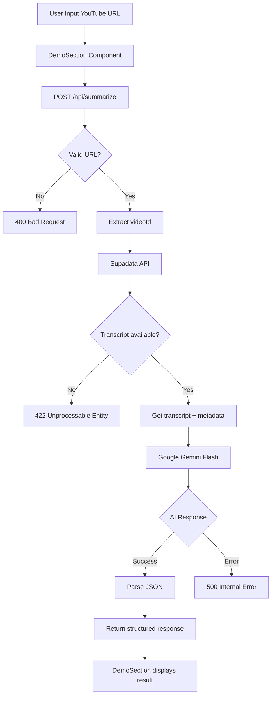

# План реализации Backend для Verdict AI

## 📋 Обзор проекта

**Frontend:** Next.js 16 с App Router (уже существует)
**Backend:** Next.js API Routes (Vercel Serverless Functions)
**Внешние API:** Supadata.ai, Google Gemini Flash

---

## 🏗️ Архитектура системы



---

## 📁 Структура файлов для создания

```
lesson2/
├── app/
│   └── api/
│       └── summarize/
│           └── route.ts          # Главный API endpoint
├── lib/
│   ├── validators.ts              # Утилиты парсинга URL
│   ├── supadata.ts                # Клиент для Supadata API
│   ├── gemini.ts                  # Клиент для Google Gemini
│   └── schemas.ts                 # Zod схемы валидации
├── __tests__/
│   └── api/
│       └── summarize.test.ts      # Unit тесты
├── .env.local                     # Переменные окружения
└── .gitignore                     # Обновить для защиты ключей
```

---

## ✅ Пошаговый план реализации

### Этап 1: Утилиты и схемы валидации

#### 1.1 Создать `lib/validators.ts`
```typescript
// Функции для извлечения videoId из YouTube URL
export function extractVideoId(url: string): string | null
export function isValidYouTubeUrl(url: string): boolean
```

**Поддерживаемые форматы:**
- `https://www.youtube.com/watch?v=VIDEO_ID`
- `https://youtu.be/VIDEO_ID`
- `https://www.youtube.com/shorts/VIDEO_ID`
- `https://www.youtube.com/live/VIDEO_ID`

#### 1.2 Создать `lib/schemas.ts`
```typescript
// Zod схема для валидации входящего запроса
export const summarizeRequestSchema = z.object({
  url: z.string().url().refine(isValidYouTubeUrl)
})

// Zod схема для ответа API
export const summaryResponseSchema = z.object({
  videoId: z.string(),
  title: z.string(),
  channelName: z.string(),
  thumbnailUrl: z.string(),
  verdict: z.enum(['MUST_WATCH', 'SKIP', 'RECAP_ONLY']),
  verdictLabel: z.string(),
  verdictDescription: z.string(),
  summary: z.array(z.object({
    emoji: z.string(),
    text: z.string()
  }))
})
```

---

### Этап 2: API клиенты для внешних сервисов

#### 2.1 Создать `lib/supadata.ts`
```typescript
interface SupadataResponse {
  videoId: string
  title: string
  channelName: string
  thumbnailUrl: string
  transcript: string
}

export async function getVideoTranscript(url: string): Promise<SupadataResponse>
```

**Логика:**
- Запрос к `https://api.supadata.ai/v1/youtube/transcript`
- Извлечение текста из таймкодов
- Кэширование (опционально для Vercel)

#### 2.2 Создать `lib/gemini.ts`
```typescript
interface GeminiAnalysisResult {
  verdict: 'MUST_WATCH' | 'SKIP' | 'RECAP_ONLY'
  verdictLabel: string
  verdictDescription: string
  summary: Array<{ emoji: string; text: string }>
}

export async function analyzeTranscript(transcript: string): Promise<GeminiAnalysisResult>
```

**System Prompt:**
```
Ты — ассистент, который экономит время. Твоя задача — проанализировать текст видео и вернуть JSON.
1. Определи, стоит ли смотреть видео (MUST_WATCH — уникальный контент, SKIP — кликбейт, RECAP_ONLY — суть понятна).
2. Напиши краткое объяснение вердикта (1 предложение).
3. Сделай краткую выжимку из 5-7 пунктов с эмодзи.
Отвечай ТОЛЬКО валидным JSON без Markdown форматирования.
```

---

### Этап 3: Главный API Endpoint

#### 3.1 Создать `app/api/summarize/route.ts`

```typescript
import { NextResponse } from 'next/server'
import { extractVideoId } from '@/lib/validators'
import { getVideoTranscript } from '@/lib/supadata'
import { analyzeTranscript } from '@/lib/gemini'

export async function POST(req: Request) {
  try {
    const { url } = await req.json()
    
    // Валидация URL
    const videoId = extractVideoId(url)
    if (!videoId) {
      return NextResponse.json(
        { error: 'Invalid YouTube URL' },
        { status: 400 }
      )
    }
    
    // Получение данных от Supadata
    const videoData = await getVideoTranscript(url)
    
    // Анализ с помощью Gemini
    const analysis = await analyzeTranscript(videoData.transcript)
    
    // Формирование ответа
    return NextResponse.json({
      videoId,
      title: videoData.title,
      channelName: videoData.channelName,
      thumbnailUrl: videoData.thumbnailUrl,
      ...analysis
    })
    
  } catch (error) {
    console.error('Summarize error:', error)
    return NextResponse.json(
      { error: 'Internal Server Error' },
      { status: 500 }
    )
  }
}
```

---

### Этап 4: Конфигурация и безопасность

#### 4.1 Создать `.env.local`
```bash
# Supadata API
SUPADATA_API_KEY=sd_xxxxxxxxxxxx

# Google AI Studio (Gemini)
GOOGLE_GENERATIVE_AI_API_KEY=AIzaSyxxxxxxxxxxxx

# Опционально: секрет для защиты API
# API_SECRET_KEY=my_secure_random_string
```

#### 4.2 Обновить `.gitignore`
Добавить:
```
.env*.local
.env
```

---

### Этап 5: Тестирование

#### 5.1 Создать `__tests__/api/summarize.test.ts`

**Тестовые сценарии:**

| Тест | Ожидаемый результат |
|------|---------------------|
| Валидный YouTube URL | 200 OK, правильная структура JSON |
| Невалидный URL | 400 Bad Request |
| URL без субтитров | 422 Unprocessable Entity |
| Ошибка API Supadata | 500 Internal Server Error |
| Ошибка API Gemini | 500 Internal Server Error |

---

### Этап 6: Интеграция с frontend

#### 6.1 Обновить `components/demo-section.tsx`

**Изменения:**
1. Заменить демо-данные `DEMO_SUMMARY` на реальный API вызов
2. Добавить состояние `error` для отображения ошибок
3. Отображать реальные данные из API:
   - `videoId` → для ссылки на YouTube
   - `title` → заголовок видео
   - `channelName` → название канала
   - `thumbnailUrl` → миниатюра
   - `verdict` → цвет бейджа
   - `verdictLabel` → текст бейджа
   - `verdictDescription` → описание
   - `summary` → буллиты

**Типы для API ответа:**
```typescript
interface ApiResponse {
  videoId: string
  title: string
  channelName: string
  thumbnailUrl: string
  verdict: 'MUST_WATCH' | 'SKIP' | 'RECAP_ONLY'
  verdictLabel: string
  verdictDescription: string
  summary: Array<{ emoji: string; text: string }>
}
```

---

## 🔑 Необходимые API ключи

| Сервис | Получение | Стоимость |
|--------|-----------|-----------|
| Supadata.ai | https://supadata.ai/ | Freemium |
| Google AI Studio | https://aistudio.google.com/ | Бесплатно до лимита |

---

## 🚀 Деплой на Vercel

### Шаги:
1. Зарегистрироваться в Vercel
2. Привязать GitHub репозиторий
3. Добавить переменные окружения в Vercel Dashboard
4. Vercel автоматически развернет Serverless Functions

### Vercel Skills:
- ✅ **vercel-deploy** — для деплоя проекта
- ✅ **vercel-react-best-practices** — для оптимизации frontend

---

## 📦 Зависимости для добавления

```bash
npm install @google/generative-ai
npm install --save-dev jest @types/jest
```

---

## ⚠️ Ограничения Vercel Serverless

| Ограничение | Значение |
|-------------|----------|
| Timeout (Free) | 10 секунд |
| Timeout (Pro) | 60 секунд |
| Payload | 4MB |
| Memory | 1024MB |

**Рекомендации:**
- Использовать Gemini Flash (быстрая модель)
- Ограничить длину транскрипта (~50k символов)
- Добавить timeout для fetch запросов
